# OMG: 여행 계획 및 동행자 모집 플랫폼

- omg 접속 : [OMG Link](http://ohmyguide.duckdns.org/)
<br/>


OMG(Oh My Guide)는 사용자가 여행 계획을 세우고 동행자를 모집하며, 여행 후기를 공유할 수 있는 종합 여행 지원 플랫폼입니다. 실시간 소통 기능을 통해 보다 원활하고 즐거운 여행 경험을 제공하도록 설계되었습니다.

## 팀 소개 (Team)

## 👨‍👨‍👦‍👦 팀원

| [전현진](https://github.com/HyeonJinJeon) | [곽유진](https://github.com/jinijavac) | [손설빈](https://github.com/seolbb) | [김혜주](https://github.com/kimoju01) | [박경서](https://github.com/kyongseo) |
|:------------------------------------------:|:------------------------------------------:|:------------------------------------------:|:------------------------------------------:|:------------------------------------------:|
| 팀장 | 팀원 | 팀원 | 팀원 | 팀원 |

## 📅 개발 기간
2024.07.23 ~ 2024.09.06 (7주)

## 🧐 문제점
- **여행 계획의 복잡함**: 여행 일정을 세우는 데 많은 시간과 노력이 필요합니다.
- **적합한 동행자 찾기 어려움**: 함께 여행할 동행자를 구하는 것이 쉽지 않습니다.
- **여행 후기 정보의 부족**: 유용한 여행 정보를 얻고 나누는 데 제약이 있습니다.

## 💡 아이디어
여행 일정을 추천하고, 동행자를 쉽게 모집하며, 여행 경험을 공유할 수 있는 종합 플랫폼을 제공하여 여행 준비의 복잡함과 동행자 찾기의 어려움을 해결합니다.

## 💯 솔루션
여행 일정 추천, 동행자 모집, 여행 후기 공유 등 다양한 기능을 제공해 여행의 모든 과정을 지원합니다.

## 📹 주요 기능과 로직
1. **지역 명소 추천**: 여행 일정 생성시 지역을 선택하면 명소를 추천합니다.
2. **동행자 모집**: 사용자가 원하는 여행에 함께할 동행자를 모집할 수 있습니다.
3. **여행 후기 공유**: 여행 경험을 공유하고 다른 사용자의 후기에서 유용한 정보를 얻을 수 있습니다.
4. **여행 일정 관리**: 자신만의 여행 일정을 등록하고 관리할 수 있습니다. 사용자는 캘린터를 통해 자신의 일정을 한눈에 확인할 수 있습니다.
5. **실시간 채팅 기능**: 팀원 간 실시간 채팅이 가능하여 원활한 소통을 지원합니다.
6. **알림 기능**: 게시글의 댓글, 내 댓글의 대댓글, 채팅에 대한 알림 기능이 있습니다.

## 🛠 기술 스택

| 분야          | 기술                                                         | 설명                                               |
|---------------|------------------------------------------------------------|--------------------------------------------------|
| **프론트엔드**   | Thymeleaf                                                  | 서버 사이드 템플릿 엔진으로, 동적인 HTML 콘텐츠 생성 |
| **백엔드**       | Java                                                      | 애플리케이션 로직 구현을 위한 주요 언어                  |
|               | Spring                                                    | Java 기반의 프레임워크                               |
|               | Spring Boot                                               | Spring 프레임워크를 기반으로 한 확장형 프로젝트        |
| **데이터베이스** | MySQL                                                    | 데이터 저장 및 관리 용도의 관계형 데이터베이스 관리 시스템 |
|               | Redis                                                     | 알림 기능 및 세션 관리 용도의 인메모리 데이터베이스   |
| **메시징**      | Kafka                                                     | 실시간 채팅 기능 구현을 위한 메시징 시스템              |
| **배포 및 인프라**| Docker                                                   | 애플리케이션 및 서비스의 컨테이너화                     |
|               | Jenkins                                                  | CI/CD 파이프라인을 통한 자동화된 빌드 및 배포          |
| **기타**        | IntelliJ IDEA                                            | 개발 환경으로 사용                                  |
|               | kakaomap API                                             | 여행 위치 정보 제공                                 |
|               | Tour API                                                | 여행지 관련 정보 제공                              |
|               | Weather API                                             | 날씨 정보 제공                                     |
|               | Channel API                                             | 소통 및 알림 기능 제공                              |


## 아키텍처
- 전반적인 아키텍처
  <br>

<br>
- 팀 채팅 기능
  <br>
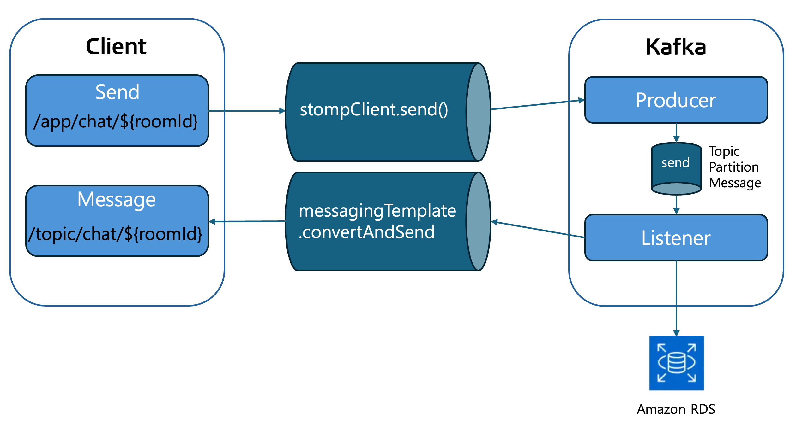
<br>
- 알림 기능
  <br>
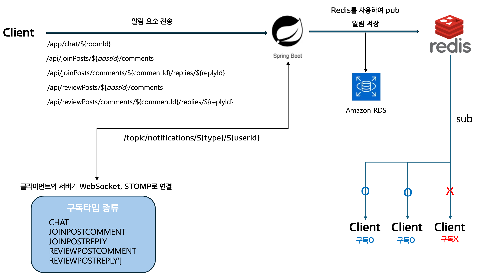

## :chart_with_upwards_trend: 성능 개선

|      구분       | 기존 구조                                     | 개선된 구조                                                                           |
|:---------------:|--------------------------------------------|:---------------------------------------------------------------------------------|
|  **처리 <br/>방식**  | 모든 채팅방을 하나의 토픽, 하나의 파티션에서 처리 | 채팅방 10개당 1개의 토픽을 사용, <br/>1개의 토픽은 10개의 파티션으로 나누어 <br/>각 채팅방이 하나의 파티션을 사용         |
|  **토픽 <br/>번호**  | N/A                                        | `roomId / 10 + 1` <br/>(예: `chatTopic1`, `chatTopic2`, ...)                      |
| **파티션 <br/>번호** | N/A                                        | `roomId % 10`<br/>(0, 1, 2, 3, ..., 9)                                           |
|    **예시**     | N/A                                        | `roomId`가 13인 경우 <br/>(**토픽**: `chatTopic2`, **파티션**: `3`)                       |
|  **미리 <br/>생성**  | N/A                                        | 기존 토픽의 5번째 파티션 사용 시 다음 토픽 미리 생성 <br/>(예: `roomId`가 15인 경우 -> `chatTopic3` 미리 생성) |

### 기대되는 성능 개선
1. **병렬 처리 능력 향상**: 여러 채팅방에서 동시에 메시지를 송수신할 수 있어 응답 시간이 감소.
2. **메모리 및 CPU 사용 최적화**: 메모리와 CPU 사용량이 더 고르게 분산되어 시스템의 안정성이 향상.
3. **스케일링 용이성**: 새로운 채팅방 추가 시 시스템의 스케일링이 더 용이해져 트래픽 증가에 유연하게 대응.
4. **메시지 지연 시간 감소**: 각 파티션이 독립적으로 작동하여 응답 시간이 줄어들 수 있음.
5. **메타데이터 갱신 시간 절약**: 미리 다음 토픽을 생성함으로써 시스템의 전체적인 응답성을 높일 수 있음.

### 성과
| 구성                                 | 처리 가능한 메시지 수 (1초) | 총 처리량 (10초 기준)  |
|--------------------------------------|------------------------------|-------------------------|
| 20개 채팅방 - 1개 파티션            | 1000 메시지                 | 10,000 메시지           |
| 20개 채팅방 - 10개 파티션 (2개 토픽)| 20,000 메시지                | 200,000 메시지          |


## :construction: 프로젝트 구조 (Project Structure)

    /src                            # 소스 코드 루트 디렉토리
    └── /domain                     # 도메인 모델 정의 관련 코드
        ├── /config                 # 도메인 관련 설정 파일들
        ├── /controller             # 컨트롤러 레이어 (API 엔드포인트)
        ├── /service                # 서비스 레이어 (비즈니스 로직)
        │   └── /impl               # 서비스 구현체
        ├── /repository             # 데이터베이스 접근 레이어 (DAO)
        ├── /dto                    # 데이터 전송 객체 (Data Transfer Objects)
        └── /entity                 # 엔티티 클래스 (DB 매핑 객체)
    
    └── /global                     # 글로벌 설정 및 공통 유틸리티
        ├── /config                 # 전역 설정 파일들
        ├── /exception              # 전역 예외 처리 클래스
        ├── /image                  # 이미지 처리 유틸리티
        ├── /jwt                    # JWT 관련 유틸리티 및 구성
        ├── /oauth2                 # OAuth2 관련 유틸리티 및 구성
        └── /security               # 보안 관련 설정 및 유틸리티

## :mag: 설치 및 실행 방법 (Installation & Setup)
<details>
<summary><strong>설치 및 실행 방법</strong></summary>

### 필수 설치 도구

- **Java 21 버전**: [Java 다운로드 링크](https://www.oracle.com/java/technologies/javase-jdk21-downloads.html)
- **Docker**: [Docker 설치 가이드](https://docs.docker.com/get-docker/)

### 실행 단계

1. **필수 도구 설치**: 위의 링크를 통해 Java 21 버전 및 Docker를 설치합니다.

2. **`docker-compose.yml` 파일 작성**: 프로젝트 디렉토리에 `docker` 폴더를 생성하고, 각 서비스에 맞는 하위 폴더와 `docker-compose.yml` 파일을 작성합니다.

    - **Kafka 폴더 및 `docker-compose.yml` 파일**

      `docker/kafka/docker-compose.yml` 파일 내용:

      ```yaml
      services:
        zookeeper:
          image: bitnami/zookeeper:latest
          ports:
            - "2181:2181"
          environment:
            - ALLOW_ANONYMOUS_LOGIN=yes
 
        kafka:
          image: bitnami/kafka:latest
          ports:
            - "9092:9092"
          environment:
            - KAFKA_CFG_ZOOKEEPER_CONNECT=zookeeper:2181
            - ALLOW_PLAINTEXT_LISTENER=yes
            - KAFKA_CFG_LISTENERS=PLAINTEXT://:9092
            - KAFKA_CFG_ADVERTISED_LISTENERS=PLAINTEXT://localhost:9092
          depends_on:
            - zookeeper
      ```

    - **Redis 폴더 및 `docker-compose.yml` 파일**

      `docker/redis/docker-compose.yml` 파일 내용:

      ```yaml
      services:
        redis:
          image: redis:latest
          container_name: redis
          command: ["redis-server", "--requirepass", "1234"]
          ports:
            - "6379:6379"
          volumes:
            - ./redis-data:/data
      volumes:
        redis-data:
      ```

    - **MySQL 폴더 및 `docker-compose.yml` 파일**

      `docker/mysql/docker-compose.yml` 파일 내용:

      ```yaml
      services:
        vacation-db:
          image: mysql
          restart: always
          environment:
            MYSQL_ROOT_PASSWORD: "1234"
            MYSQL_DATABASE: "example"
            MYSQL_USER: "your_username"
            MYSQL_PASSWORD: "your_password"
          command:
            - "--character-set-server=utf8mb4"
            - "--collation-server=utf8mb4_unicode_ci"
          volumes:
            - "./database/init:/docker-entrypoint-initdb.d/"
            - "./database/datadir:/var/lib/mysql"
          platform: linux/x86_64
          ports:
            - "3306:3306"
      ```

3. **Docker 컨테이너 실행**: 터미널에서 각 서비스의 폴더로 이동하여 Docker Compose 명령어를 실행합니다.

   ```bash
   # Kafka 서비스 실행
   cd docker/kafka
   docker-compose up -d

   # Redis 서비스 실행
   cd ../redis
   docker-compose up -d

   # MySQL 서비스 실행
   cd ../mysql
   docker-compose up -d

4. **데이터베이스에 데이터 추가**: local에서 처음으로 프로젝트를 진행하려고 할 때 city와 role에 관한 초기 데이터를 추가합니다.
    ```sql
    INSERT INTO cities (name) VALUES ('서울'), ('부산'), ('대구'), ('인천'), ('광주'), ('대전'), ('울산'), ('세종'), ('춘천'), ('원주'), ('강릉'), ('동해'), ('태백'), ('속초'), ('삼척'), ('홍천'), ('횡성'), ('평창'), ('정선'), ('영월'), ('수원'), ('고양'), ('용인'), ('성남'), ('부천'), ('남양주'), ('안산'), ('안양'), ('평택'), ('의정부'), ('군포'), ('오산'), ('시흥'), ('하남'), ('의왕'), ('양주'), ('파주'), ('광명'), ('구리'), ('여주'), ('창원'), ('김해'), ('진주'), ('양산'), ('거제'), ('통영'), ('사천'), ('밀양'), ('함안'), ('거창'), ('창녕'), ('산청'), ('의령'), ('고성'), ('하동'), ('합천'), ('포항'), ('경주'), ('구미'), ('김천'), ('안동'), ('영주'), ('상주'), ('문경'), ('경산'), ('영천'), ('청송'), ('영양'), ('봉화'), ('울릉'), ('예천'), ('성주'), ('군위'), ('의성'), ('천안'), ('아산'), ('서산'), ('공주'), ('보령'), ('논산'), ('계룡'), ('당진'), ('홍성'), ('예산'), ('서천'), ('청양'), ('부여'), ('금산'), ('청주'), ('충주'), ('제천'), ('단양'), ('음성'), ('진천'), ('괴산'), ('보은'), ('옥천'), ('영동'), ('여수'), ('순천'), ('목포'), ('나주'), ('광양'), ('담양'), ('곡성'), ('구례'), ('고흥'), ('보성'), ('장흥'), ('강진'), ('해남'), ('완도'), ('진도'), ('신안'), ('무안'), ('영암'), ('전주'), ('군산'), ('익산'), ('남원'), ('정읍'), ('김제'), ('완주'), ('진안'), ('무주'), ('장수'), ('고창'), ('임실'), ('순창'), ('제주'), ('서귀포');
    ```
    ```sql
   INSERT INTO roles (id, name) VALUES (1, 'ROLE_ADMIN');
    INSERT INTO roles (id, name) VALUES (2, 'ROLE_USER');
    ```
---
</details>

## :pager: 데모 (Demo)
<details>
<summary><strong>화면 구성</strong></summary>

<div align="center">

### 메인 페이지

||
|:------------------------------------------------------------------------:|
|                                  메인 페이지                                  |

### 회원 가입 및 로그인

|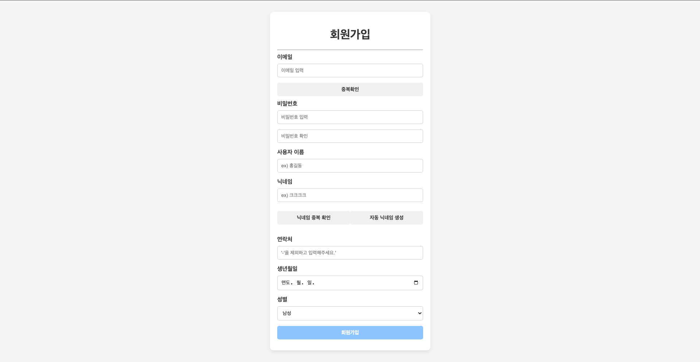|          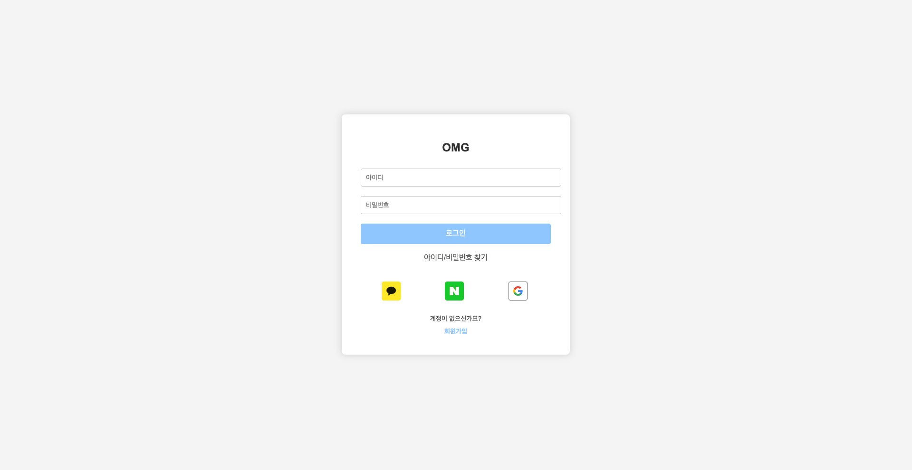           |
|:-----------------------------------------------------------------------:|:--------------------------------------------------------------------------------------------:|
|                                  회원 가입                                  |                                             로그인                                              |

### 여행 일정 생성

|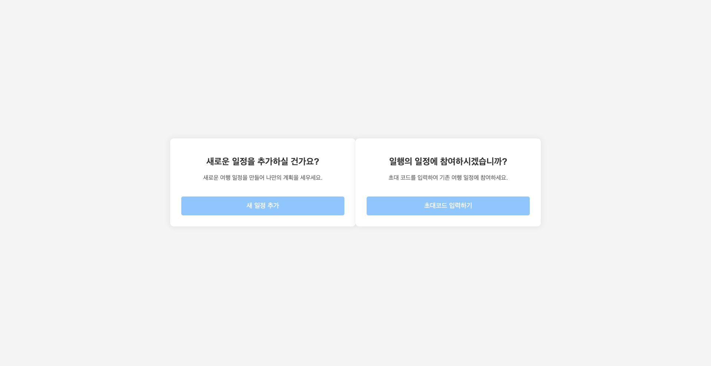| 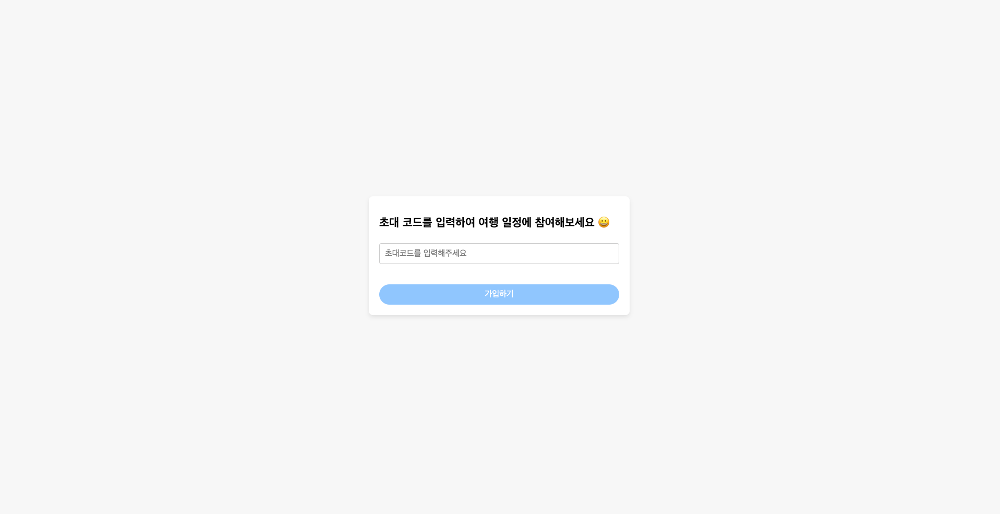 |
|:----------------------------------------------------------------------:|:------------------------------------------------------------------------:|
|                             여행 일정 생성 방법 선택                             |                             기존 일정 참여 (초대코드)                              |
|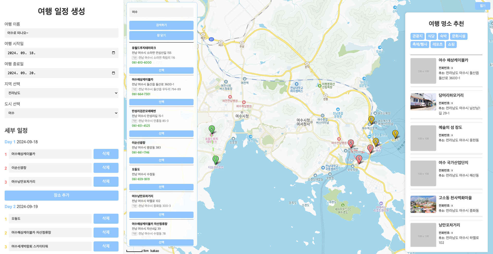|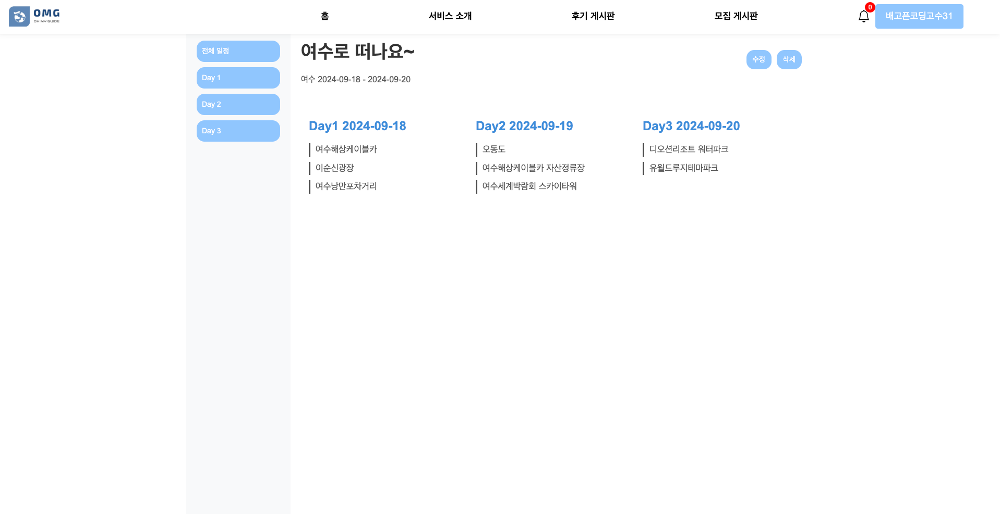|
|                                 직접 생성                                  |                                  일정 상세                                   |

### 일행 모집 및 여행 후기 게시판

| 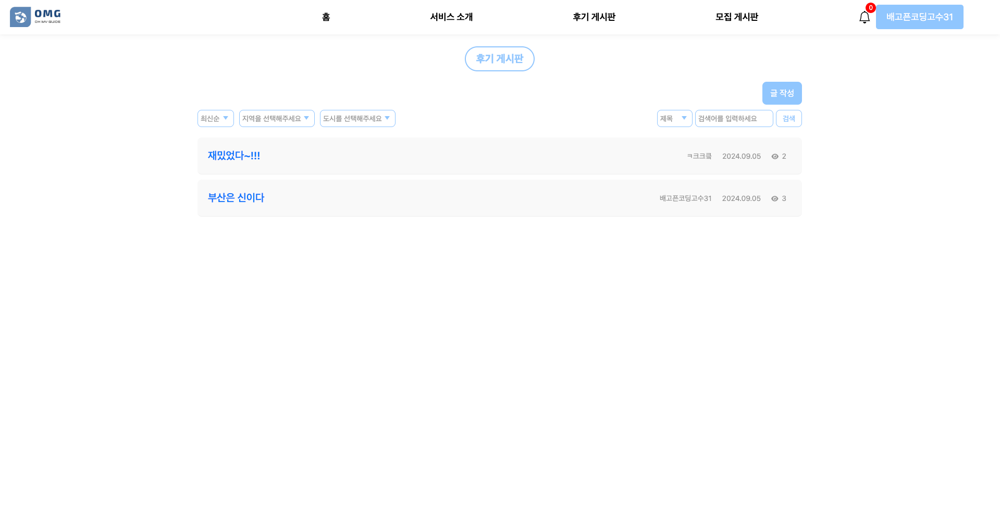 |
|:------------------------------------------------------------------------:|
|                           일행 모집 및 여행 후기 게시글 목록                           |

| 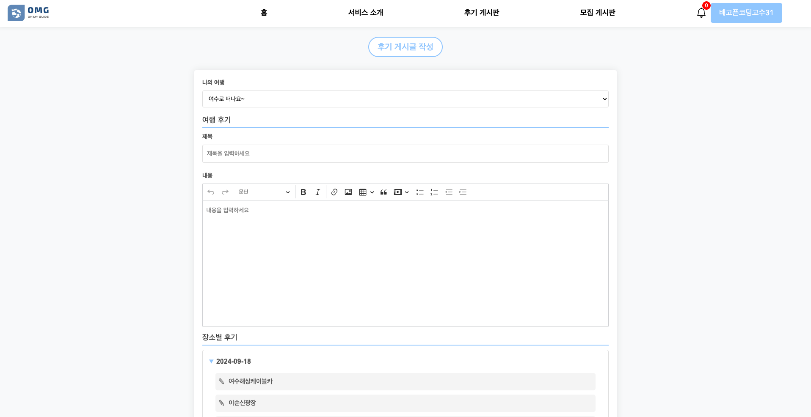 | 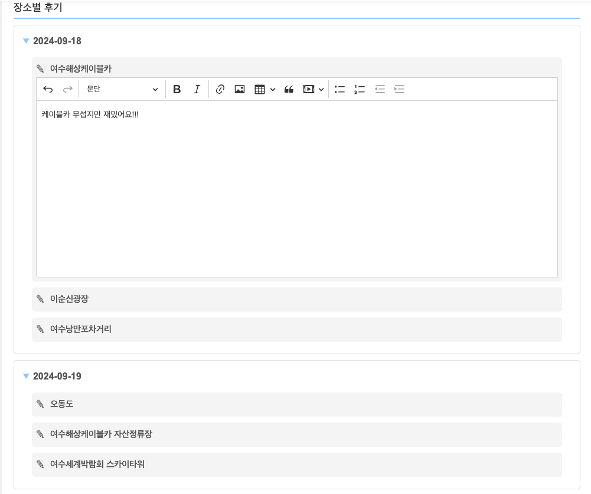 |
|:------------------------------------------------------------------------:|:------------------------------------------------------------------------:|
|                             여행 후기 게시글 작성 (1)                             |                             여행 후기 게시글 작성 (2)                             |

| 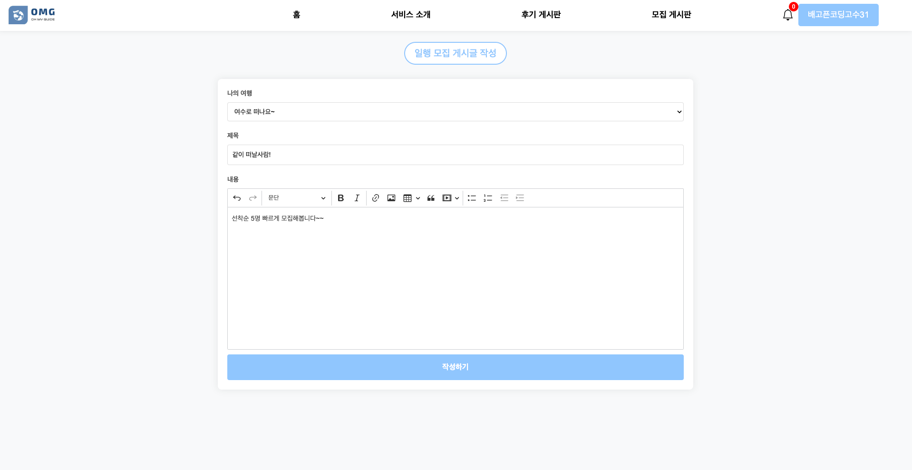 |
|:------------------------------------------------------------------------:|
|                               일행 모집 게시글 작성                               |

| 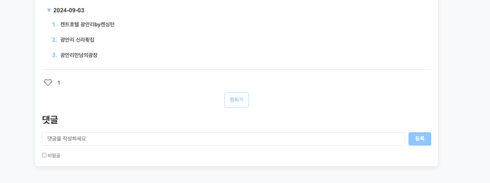 | 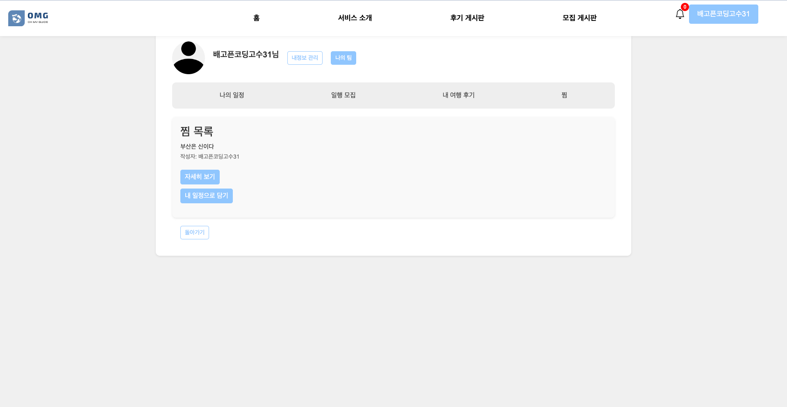 |
|:------------------------------------------------------------------------:|:------------------------------------------------------------------------:|
|                                여행 일정 찜하기                                 |                                   찜 목록                                   |

### 마이 페이지

| 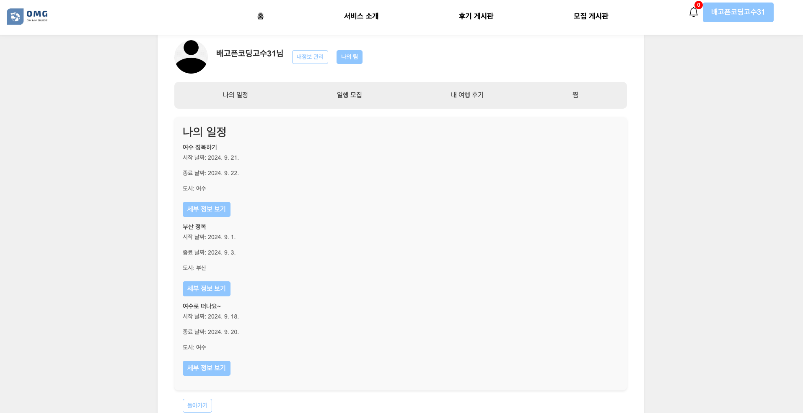 | 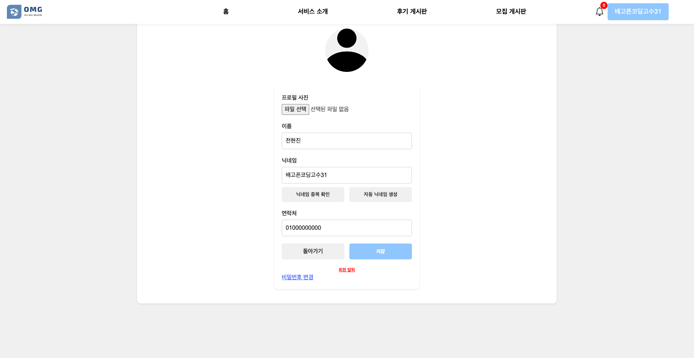 |
|:-------------------------------------------------------------------------:|:-------------------------------------------------------------------------:|
|                                 나의 여행 관리                                  |                                 회원 정보 수정                                  |

### 채팅

|  |
|:-------------------------------------------------------------------------:|
|                                   팀 채팅                                    |

### 알림

| 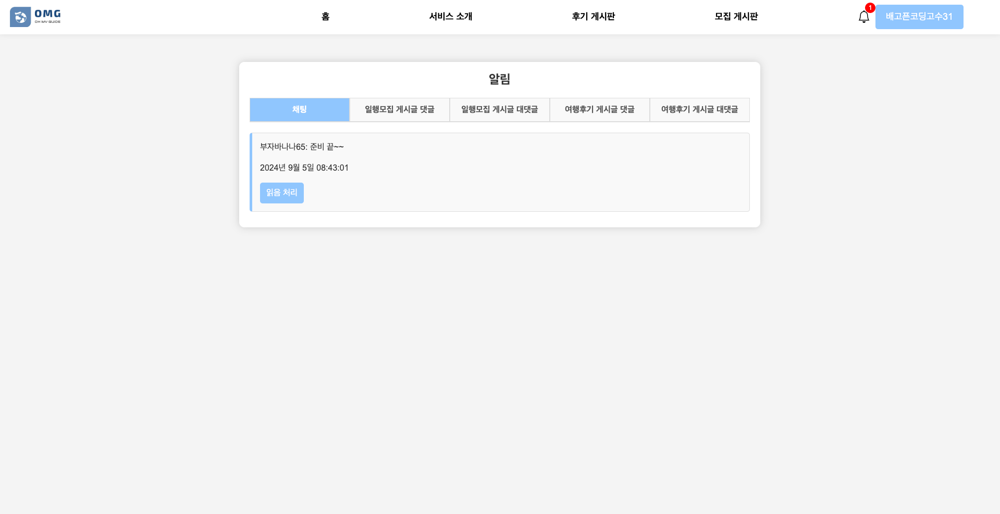 |
|:-------------------------------------------------------------------------:|
|                                   댓글 알림                                   |

### 관리자 페이지

| 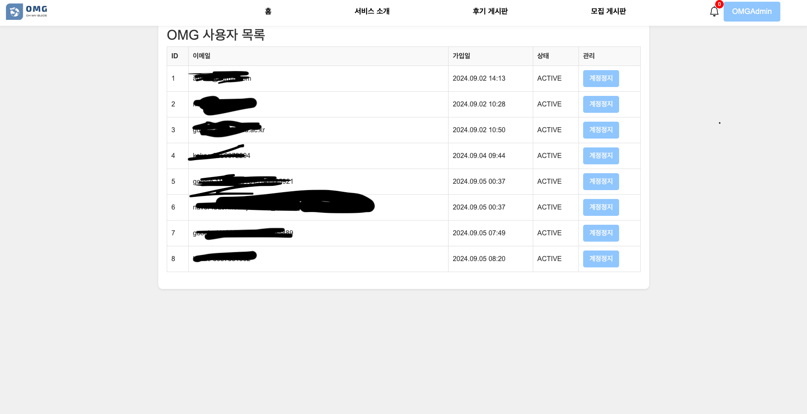 |  |    |
|:-------------------------------------------------------------------------:|:-------------------------------------------------------------------------:|:---------------------------------------------------------------------------:|
|                                  사용자 목록                                   |                                  게시글 목록                                   |                                    공지사항                                     |


</div>

</details>

## :pencil: 기여 방법 (Contributing)

- **브랜치 생성**: 📑[Branch Convention](https://github.com/oh-my-guide/OMG_project/wiki/Branch-Convention)
- **이슈 제출**: 📑[Issue Convention](https://github.com/oh-my-guide/OMG_project/wiki/Issue-Convention)
- **Pull Request (PR) 작성**: 📑[PR Convention](https://github.com/oh-my-guide/OMG_project/wiki/PR-Convention)
- **코드 스타일 가이드**: 📑[Coding Convention](https://github.com/oh-my-guide/OMG_project/wiki/Coding-Convention)
